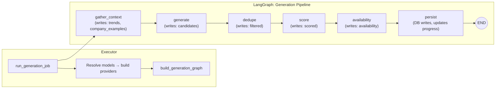

## 6. Agents: LangGraph Design

Graph (job execution paths):
Entry A) 1.1) gather_trends (optional, TODO) →
Entry B) 1.2) gather_similar_names (optional) →
2) generate_names →
3) dedupe_and_filter →
4) score_names →
5) availability_precheck (cheap heuristics) →
6) availability_verify (registrar APIs) →
7) persist_results →
8) notify_human (optional)

### LangGraph stateflow (current implementation)



State schema (typed Pydantic):
```
class GenerationState(BaseModel):
  # Who and how
  user_id: UUID
  entry_path: Literal['investor','business']
  job_id: UUID
  # Inputs
  topic: str
  categories: list[str]
  tlds: list[str]
  requested: int
  business_prompt: str | None = None
  # Context gathered
  trends: list[Trend] = []
  company_examples: list[CompanyExample] = []
  # Pipeline artifacts
  candidates: list[Candidate] = []
  filtered: list[Candidate] = []
  scored: list[ScoredCandidate] = []
  availability: list[AvailabilityResult] = []
```

---

Overview & Conventions
- Runtime: Python LangGraph. All blocking work uses async I/O where applicable.
- Orchestration: The API (FastAPI) creates a job and, for now, schedules LangGraph execution in-process via `asyncio.create_task`; once long-running steps are added we will migrate to Celery workers. For small availability batches, the API is currently invoking availability checks synchronously without a Celery handoff. If Celery is required, we will move to Celery.
<!-- - Checkpointing: After each major node boundary, the graph stores a checkpoint (Postgres-backed store) keyed by `job_id` and step name for resumability and idempotency.
Observability: Each node logs to Langfuse with prompt/version (where applicable), step metrics, and error traces; progress counters update `jobs`/`agent_runs`. (Not implemented, maybe can consider later.) -->
 - Providers: LLM/registrar/Domain name availability checking API - abstracted behind provider interfaces; vendors API keys are fetched via env flags; registrar API calls are capped per job and rate-limited per provider. WhoisJSON is the preferred registrar integration, WhoAPI is an opt-in alternative, and if neither registrar credential is configured the graph falls back to the probabilistic stub provider. Current implementation returns empty context from `gather_context`; investor-specific retrieval remains a TODO.
 <!-- LLM Vendors are rate-limited - to avoid huge bills. -->
 - User context: `user_id` is populated from Supabase JWT; used for quotas, provenance on `jobs.created_by`, and scoping of results visible in the Console.

Start Modes & Selection
- Two entry pathways can initiate a job:
  - Entry A (Investors): `gather_trends` for general research. Investors may optionally provide a short prompt; both prompt and trends inform generation.
  - Entry B (Businesses): `gather_similar_names` for business owners who supply a brief about their idea/use case;
 - Selection logic:
   - If a business prompt is present → run `gather_similar_names`.
   - If only investor research (no business prompt) → run `gather_trends`.
   - If both are present → run both and merge contexts (dedupe) before `generate_names`.

> Current implementation prioritizes the Business flow; investor-specific retrieval will be enabled once trend datasets are ready.

Node Details


1.1) gather_trends (Path‑1 for domain name investors; optional in Entry A/B, TODO)
- Purpose: Retrieve list of topics, categories and trends to give as context to domain name generation step.
- Inputs: `topic`, `categories`, optional investor prompt, and optionally prior `trends` in state (for retries/resumes).
- Outputs: `trends: list[Trend]` (deduplicated, tagged, optionally embedded).
- Data sources: `trends` table (when v1.5 schema is present), cached HTTP sources, or manual seed records.
- Rules:
  <!-- - Time budget per job; respect `limit` and `source` feature flags.
  - Deduplicate by title/url hash; collapse near-duplicates. -->
- Failure handling: If unavailable, continue with empty `trends` and mark a soft warning (non-blocking).
- Implementation status: currently returns an empty trends list until real data sources are wired up.


1.2) gather_similar_names (Path‑2 for businesses looking for names; prompt‑driven)
- Purpose: Retrieve examples of similar businesses and their names to ground generation in the user’s brief (domain, category, target audience, tone).
- Inputs: Business prompt (idea/use case, constraints like tone/length/keywords/TLDs), optional `topic/categories`.
- Outputs: `company_examples: list[CompanyExample]` and `derived_categories/tags` to inform prompts.
- Implementation status: currently returns an empty company_examples list until data sources are implemented.
- Data sources:
  - `company_names` table populated via scraping (e.g., YC lists, Crunchbase summaries, other directories). Each row ideally has: company_name, domain, description, categories/tags, source, and optional embeddings.
  - When available, embeddings enable semantic similarity; otherwise, keyword/category matching is used.
- Method:
  - Parse the prompt → extract industry, audience, tone, constraints.
  - Query `company_names`:
    - Filter by extracted categories/keywords.
    - Rank by embedding similarity to the company descriptions.
    - Return top‑K examples with fields { name, domain, description, categories, source, score }.
  - Deduplicate examples by domain/name; normalize categories/tags set.
  - Derive prompt hints (e.g., “avoid overly generic patterns”, desired syllable counts, style/tone) from examples.
- Rules:
  - Retrieval‑only; no availability checks or LLM naming here.
  - Respect time budgets and cap K to avoid prompt bloat downstream.
- Failure handling: If sources unavailable, proceed with empty examples and prompt content; record a soft warning.


2) generate_names
- Purpose: Produce a pool of brandable candidate domain names given the following (many are optional): `business_prompt`, `topic`, `categories`, preferred `tlds`, `trends`, `company_examples`.
- Inputs: `topic` (optional for Entry B), `categories`, `tlds`, `requested`, `trends`, `business_prompt` and `company_examples`.
- Outputs: `candidates: list[Candidate]` size ≥ `requested × oversample_factor` (e.g., 2–3x for headroom).
- Method:
  - Prompt LLM with structured instructions to avoid hyphens/numbers unless requested; encourage pronounceable, short, brandable labels; include rationale briefly.
  - LiteLLM calls the selected `generation_model` supplied by the API/job, enforcing a JSON-only response schema so swapping vendors only requires a model string change.
  - Context assembly: merge `trends` (Entry A) and `company_examples` + prompt (Entry B) into concise bullets for the system prompt; dedupe overlapping tags and keep within token budget.
  - Generate label-first; TLD assignment may happen later based on `tlds` preferences and validity rules.
  - Capture prompt version in Langfuse; tag with rubric and model info. (This is to be implemented in latest version.)
<!-- - Constraints: Maximum token/call budget per job; batch LLM calls when needed; backoff on vendor rate limits.
Failure handling: Retry with exponential backoff for transient errors; on persistent failure, reduce batch size or fall back to heuristic mini-generator. -->

3) dedupe_and_filter
- Purpose: Canonicalize and cull raw candidates before expensive scoring and availability.
- Inputs: `candidates`.
- Outputs: `filtered`.
<!-- - Canonicalization: lowercase label, ASCII fold, normalize punctuation/whitespace;
- Dedupe:
  - Exact: drop identical fingerprints.
  - Near-duplicate: collapse via similarity (edit distance or n-gram Jaccard) and keep the best representative. -->
- Filters:
  - For now no filters, but in the future it could be something like the following:
    - Length bounds (e.g., 4–12 characters unless overridden).
    - Allowed characters and patterns (avoid hyphens/numbers by default).
  <!-- - Profanity/reserved-word blacklist.
  - Basic topical relevance heuristics using `topic/categories` keywords. -->
- Notes: No network I/O here; aim for fast, deterministic pruning. Track counts removed and reasons for telemetry.
  Current implementation performs simple de-duplication by label; oversampling and near-duplicate pruning remain TODOs.

Types (documentation)
```
class CompanyExample(BaseModel):
  name: str
  domain: str | None = None
  description: str | None = None
  categories: list[str] = []
  source: str | None = None
  score: float | None = None
```

4) score_names
- Purpose: Assign quality scores per candidate using an LLM judge.
- Inputs: `filtered`.
- Outputs: `scored` (each with component scores and an `overall_score`).
<!-- - Heuristics:
  - Length desirability curve; vowel/consonant patterns; n-gram familiarity; syllable count; letter diversity.
  - Deterministic, unit-tested; produces partial scores and feature vectors. -->
- LLM judge:
  - Prompted to rate memorability, pronounceability, brandability, and overall_score considering everything; asks for short rationale.
  - Chain-of-thought disabled; rationale is concise and non-sensitive.
  - Prompt/version tracking via Langfuse is deferred; sampling params remain pinned.
  - LiteLLM routes scoring to the requested `scoring_model`, adhering to a JSON-only response contract for deterministic parsing with integer scores (1–10).
- Aggregation: Compute `overall_score` (e.g., weighted mean) with rubric versioning.

5) availability_precheck (cheap heuristics)
- Purpose: Use DNS heuristics and negative cache to avoid unnecessary paid registrar checks.
- Inputs: `scored` (or `filtered` if skipping scoring first).
  For now this node is skipped; the graph proceeds directly to registrar checks. Track this as a TODO when availability heuristics are ready.
<!-- - Outputs: Partial `availability` results with statuses `registered` or `unknown` (never `available` here).
- Method:
  - Async DNS lookups for A/AAAA/CNAME, NS/SOA.
  - If records exist or domain resolves, mark as `registered` (likely).
  - If no signals, mark as `unknown` and proceed to verify step.
  - Consult negative cache/TTL to skip recent `registered` results when allowed.
- Limits: Concurrency caps per resolver; per-domain timeout; jittered retries for transient NXDOMAIN/timeout. -->

-6) availability_verify (registrar APIs)
- Purpose: Confirm availability via registrar providers for domains with `unknown` status.
- Inputs: Results from precheck.
- Outputs: `availability` finalized statuses: `available | registered | error` with provider details.
- Providers: Pluggable (WhoisJSON primary; WhoAPI optional via feature flags). All raw responses recorded for audit.
  - If no registrar provider credentials are present, availability verification defers to the probabilistic stub provider so jobs can still complete without paid lookups.
- Method:
  - Preferred integration: https://whoisjsonapi.com/v1/status (implementation: `services/agents/providers/whoisjson.py` ; Documentation `agentic_development_docs/tools_documentation/whoisjsonapi_documentation.md` for API documentation reference).
  - Batch requests when supported; respect vendor quotas and per-minute caps.
  - Retry strategy for 5xx/timeouts; circuit-breaker if sustained failure.
  - Map heterogeneous provider responses to standardized statuses.
- Persistence: Each check appended to `availability_checks` with `method`, `registrar`, `status`, `raw`, optional `ttl_sec`.

7) persist_results
- Purpose: Upsert graph outputs into Postgres with idempotency.
- Inputs: `filtered`, `scored`, `availability`, `job_id`.
- Outputs: DB rows in `domain_names`, `dn_evaluations`, `dn_availability_status` (+ v1.5 tables when present) and updated `jobs` progress.
- Semantics:
  - Domains: upsert by `(label, tld)`; store lowercase label and display name separately.
  - Evaluations: upsert by `domain_id`; compute and persist `overall_score` and rubric version.
  - Availability: upsert `dn_availability_status` (latest) and append to `availability_checks` for history.
  - Agent provenance fields populated (`processed_by_agent`, `agent_model`).
- Transactions: Use chunked transactions with retry on serialization conflicts.
- Idempotency: Use `job_id` + candidate fingerprint to avoid duplicates on resume.

8) notify_human (optional) - not doing for now.
- Purpose: Signal completion or action-worthy events to humans.
- Methods: Enqueue a notification (email/Slack/webhook) and/or set `jobs.status` to `succeeded/partial/failed`.
- UI links: Provide Console deep links to job detail and to filtered domain lists.

Parallelism & Scheduling
- Subgraphs: `score_names` and `availability_*` - default is sequential `score → availability` for simpler UX. Maybe in the future, these two nodes can run in separate branches; 
- Chunking: Process candidates in chunks (e.g., 25–50) to bound memory and API limits.
- Concurrency: Bounded per provider/resolver; backpressure ensures quotas are not exceeded.

Checkpointing & Resilience
- After each node, persist checkpoint with hash of inputs/outputs; resume from last good state.
- On failure, mark `agent_runs.status` and include error; API exposes job status and error message.
- Idempotent writes ensure safe retries without duplicating rows.

Configuration
- Env flags: model/provider selection, concurrency caps, time budgets, rubric weights, availability thresholds, DNS timeouts.
- Settings expose an optional LiteLLM model allowlist; API validation rejects requests outside this set and defaults fall back to configured generation/scoring models. Generation and scoring prompts run through LiteLLM with JSON-only schemas, and the selected model names are persisted on each job (`jobs.params`) so API consumers can display the active configuration.
- Feature flags: enable/disable `gather_trends`, choose registrar providers, toggle LLM judge.

Observability & Metrics
- To be implemented later
- TODO: Integrate Langfuse traces for LLM/tool calls with prompt/version tracking linked to `agent_runs.trace_id`.
- Metrics: counts (generated, filtered, scored, checked), latency per node, provider error rates, duplicate ratio.
- TODO: Enable Sentry and OTEL instrumentation across API → worker → DB.

Security & Limits
- Respect user quotas and org budgets enforced in API when creating jobs.
- Vendor keys are read from environment; no secrets stored in state or logs.

Testing & Evals
- Unit tests for deterministic nodes (dedupe/filter) and LLM provider integration stubs.
- Recorded HTTP cassettes (VCR.py) for DNS/registrar interactions.
- Golden set comparisons for LLM judge stability; prompt versioning in Langfuse (TODO).

Acceptance Criteria (Agent Flow)
- Given a job with topic and TLDs, the graph generates candidates, dedupes/filters them, scores them, checks availability, persists results, and updates job status with observable traces, within configured budgets.
